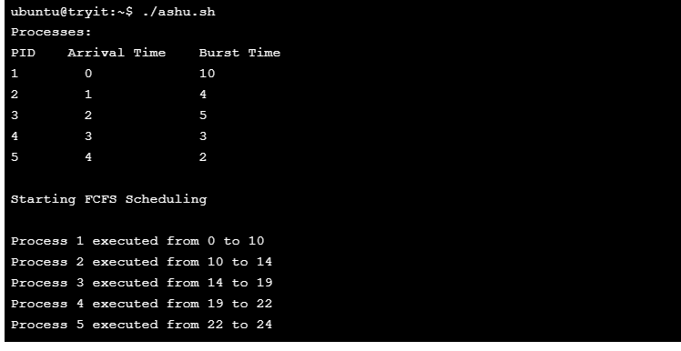

```markdown
# 🧠 Operating Systems Mini Projects

Welcome! This repository contains two shell scripting mini-projects created as part of my 2nd-year Operating Systems coursework at Thapar University.

---

## 📁 Projects Included

### 1. 🏦 ATM Transaction System (Shell Scripting)
A simulation of a basic ATM interface that supports deposit, withdrawal, and balance inquiry functionalities.

#### 🔧 Features
- Simple text-based ATM interaction.
- Tracks balance dynamically with every operation.
- Prevents overdraft and alerts the user for insufficient funds.
- Visual "loading" effect using random Unicode.

#### ▶️ How to Run

```bash
chmod +x atm.sh
./atm.sh
```

#### 🖥️ Sample ATM Script

```bash
#!/bin/sh
# ... [script code as shown earlier]
```

#### 📸 Screenshots


---

### 2. ⏱️ First Come First Serve (FCFS) CPU Scheduling

A basic FCFS CPU scheduling simulator written in Bash. It simulates the execution order of processes using the First Come First Serve algorithm and prints a Gantt chart.

#### ⚙️ How It Works

- You define processes with their arrival times and burst times.
- The script schedules them in FCFS order.
- It generates and prints a Gantt chart representation of execution.

#### ▶️ How to Run

```bash
chmod +x fcfs.sh
./fcfs.sh
```

#### 🖥️ Sample FCFS Script

```bash
#!/bin/bash
# First Come First Serve (FCFS) CPU Scheduling Script

# ... [full script code from earlier]
```

#### 📊 Output Example

```
Processes:
PID    Arrival Time    Burst Time
1        0             10
2        1             4
3        2             5
...

Process 1 executed from 0 to 10
Process 2 executed from 10 to 14
...

Gantt Chart:
P1(10) P2(4) P3(5) P4(3) P5(2)
```

#### 📸 Screenshots

  


---

## 📄 Project Report

The detailed write-up and documentation for the FCFS project are available here:

📘 [`project_file_os_fcfs.docx`](./project_file_os_fcfs.docx)

---

## 🛠️ Technologies Used

- **Shell Scripting** (`bash`, `sh`)
- `figlet`, `shuf`, basic shell utilities
- CLI-based UI for interaction
- Gantt Chart generation using array logic

---

## 📚 Learnings & Takeaways

- Process scheduling algorithms like FCFS
- Shell scripting fundamentals
- Building interactive scripts
- Simulating systems with text-based UIs

---

## 👨‍💻 Author

**Pankaj**  
> B.E. CSE @ Thapar University  
> Data Science Elective | DSA in C++

---

## 🌱 Future Improvements

- Add more CPU scheduling algorithms (SJF, RR, Priority)
- Implement multi-user support in ATM system
- Add input validation and logging
- Export Gantt chart or transaction history to file

---

📬 Feel free to explore and reach out if you have suggestions or ideas to improve these projects!
```

---
